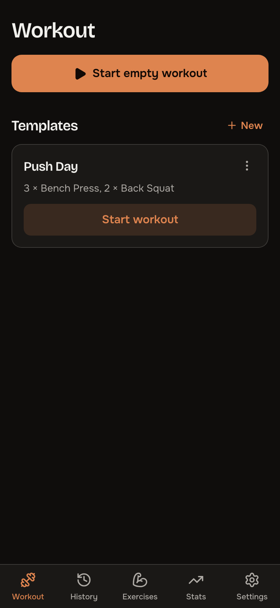
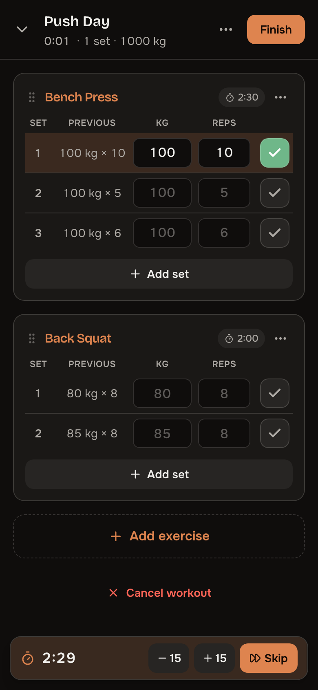
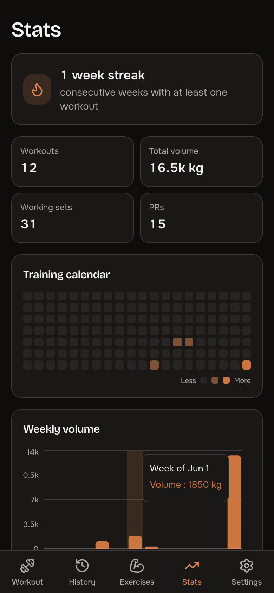
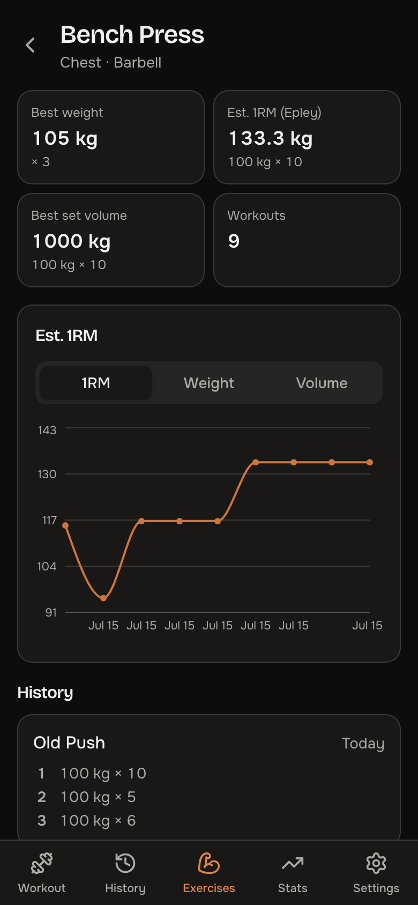
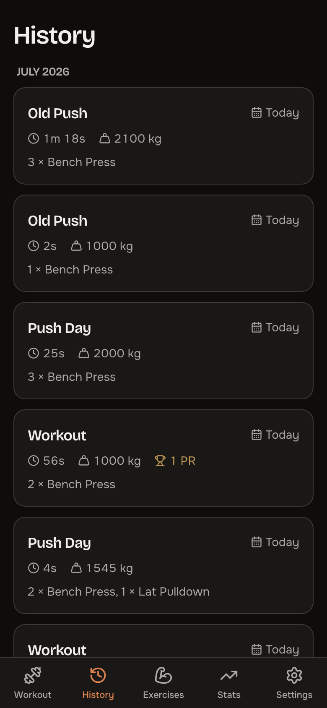
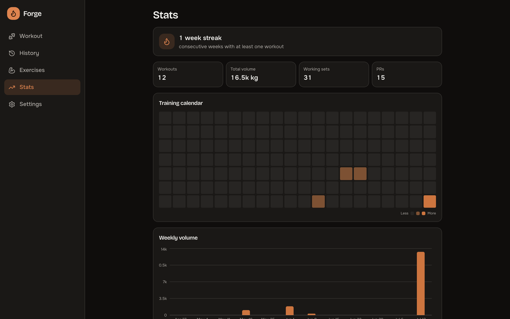

# Forge

Self-hosted workout tracking for weight training, running entirely on your own
server: templates, set/rep/weight logging with previous-workout ghosts, rest
timers between sets, supersets, personal records, and progress charts. Your
training data stays yours. No cardio, by design.

Sibling app to [Tome](../tome): same design language (warm paper / charcoal
surfaces, OKLCH tokens, Onest + Bricolage Grotesque), its own ember accent.

| Workout | Live logging | Stats |
|---|---|---|
|  |  |  |

| Progress | History |
|---|---|
|  |  |



## Features

- **Workout logging** — start empty, from a template, or repeat a past workout;
  per-set weight × reps with the previous workout's numbers as tap-to-accept
  ghosts; warm-up sets (excluded from PRs and volume); **supersets** with
  group-aware rest timing; optional **RPE** per set; bodyweight exercises
  complete on reps alone; swipe a set to delete; drag to reorder exercises;
  pinned per-exercise notes shown while training
- **Rest timer** — starts automatically when you check off a set, per-exercise
  override or account default, ±15s / skip, sound (toggleable) + vibration;
  survives reloads and follows you across tabs; **push alerts on the lock
  screen** when hosted over HTTPS (see `docs/https.md`)
- **Offline-tolerant** — set logging applies instantly and queues through gym
  dead zones, syncing when the connection returns
- **Templates (routines)** — target set counts and rest times, duplicate, drag
  to reorder
- **History** — every workout with duration, volume, and PRs; fully editable
  after the fact (sets, exercises, date — PRs recompute chronologically)
- **Records & progress** — per-exercise best weight, estimated 1RM (Epley),
  best set volume, rep records, and charts over time
- **Stats** — weekly streak, training calendar, weekly volume with RPE trend,
  muscle split, push/pull balance, block-over-block comparison, measured rest
  & session density, relative strength (e1RM ÷ bodyweight), time-of-day
  strength index, stalled-lift alerts, PR trajectory, year in review
- **Body measurements** — weight, body fat, circumferences with trend charts
- **Training plans** — StrongLifts 5×5, PPL, Upper/Lower, Full Body, one tap
  to adopt into your templates
- **Programs (periodization)** — 5/3/1 and linear-block cycles with per-lift
  training maxes that advance themselves; sessions arrive with every
  prescribed set prefilled
- **Plate calculator** — per-side plate breakdown for barbell work
- **Strong import / CSV export** — bring your full history over; never locked in
- **Exercise library** — 108 seeded weight exercises with grips and variation
  families (Pull-Up ↔ Chin-Up ↔ wide/neutral, bench family, deadlift family,
  ...), combined family charts, custom exercises, bulk re-categorization
- **Integrations** — signed webhooks, Prometheus metrics, a dashboard widget
  endpoint for gethomepage, Apple Health ingest (Health Auto Export), optional
  MQTT for Home Assistant, and a weekly digest over Web Push
- **Multi-user** — first-run setup creates the admin; admins manage users in
  Settings; JWT auth
- **PWA** — installable, launch splash screens, dark (default) / light /
  true-black OLED themes, drag-dismissable sheets, edge-swipe back

## Self-hosting

```bash
docker compose up -d --build
```

Then open http://localhost:8081 — the first visit walks you through creating
the admin account. Full documentation — including every formula behind the
stats — lives at **https://forge.bndct.sh**.

Environment variables:

| Variable | Default | Purpose |
|---|---|---|
| `FORGE_SECRET_KEY` | auto-generated, persisted in `/data/secret_key` | JWT signing secret |
| `FORGE_DATA_DIR` | `/data` | SQLite database + secret key |
| `FORGE_PORT` | `8081` | HTTP port (dev convenience; the container binds 8081) |
| `FORGE_OIDC_*` | disabled | Optional OIDC single sign-on — see `docs/sso.md` |

Single volume: `/data` (SQLite in WAL mode). Back it up, and you have
everything — or enable nightly snapshots in Settings → Data (admin) and
they land in `/data/backups`.

## Development

```bash
./dev.sh   # backend :8081 (uvicorn --reload) + frontend :5174 (vite HMR)
```

Backend: Python 3.12, FastAPI, SQLAlchemy 2.0, SQLite. Frontend: React 19,
Vite, TypeScript strict, Tailwind CSS 4, Lucide icons, Recharts.

```
forge/
├── backend/
│   ├── api/          # auth, users, exercises, routines, workouts (+ sets)
│   ├── core/         # config, database, security, clock
│   ├── models/       # user, exercise, routine, workout
│   ├── schemas.py    # pydantic request/response models
│   ├── serializers.py# shared workout serialization + PR/1RM helpers
│   └── seed.py       # seeded exercise catalogue (weights only)
└── frontend/src/
    ├── components/   # AppShell, SetRow, RestTimerBar, ExercisePicker, Sheet, Segmented
    ├── pages/        # WorkoutHome, ActiveWorkout, RoutineEditor, History, WorkoutDetail, Exercises, ExerciseDetail, Settings, Login, Setup
    ├── contexts/     # AuthContext, WorkoutContext
    └── lib/          # api, timer (rest timer engine), theme, format, types
```
